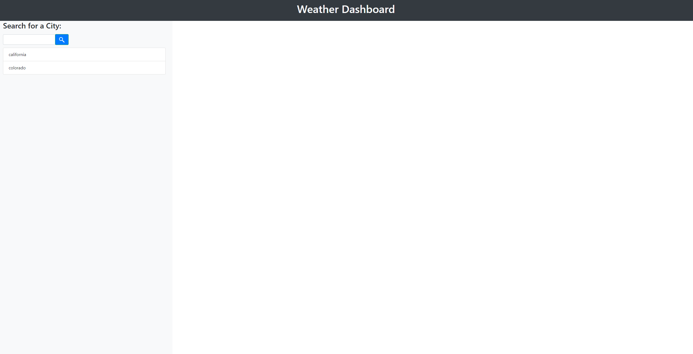
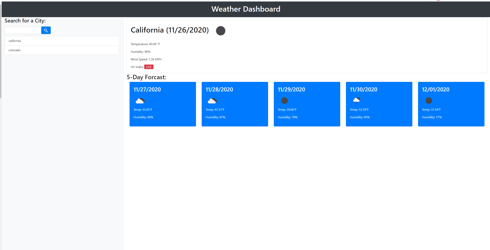
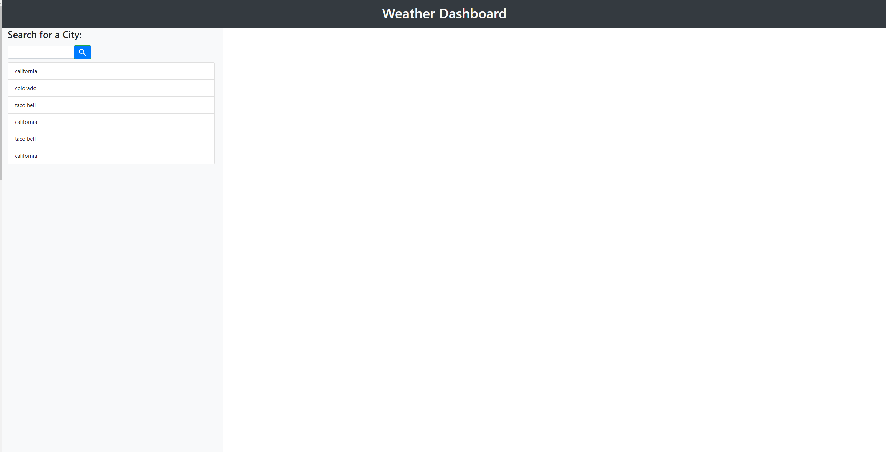

# HW6
Weather Dashboard

# Introduction

For this assignment, you must create a weather dashboard using Server-Side api, using OpenWeather API in order for the website to display various of weathers from different cities
and states. Within the site, the **Weather Dashboard** will includes:
  * A Search Bar 
    * To Search for a city/state
  * A display for the weather
    * City Weather for the current day
      * Current Weather Img
      * Temperature in Fahrenheit 
      * Humidity
      * Wind Speed (MPH)
      * UV Index
        * Colors for favorable, moderate, or severe 
    * 5-Day forcast after the user's current day
      * Weather Img
      * Temperature in Fahrenheit
      * Humidity
  * Search History
  
 # Start Up
  
  

The user will be greeted to this page, this will not display the weather until the user searches up for a city. If this is the first time the user has used the site, no history will be displayed but instead will say "No search history available" in blue. 

**NOTE:** The heading for the website is clickable however, it leads to nowhere at the current state and will be updated eventually. 

# Weather Search 

  

If the user searches or clicks the past history for the correct city/state. It will display the given city current day and the 5-day Forcast. This will help the user to know the weather and tempurature of the given day and the weather of the 5 days after the current day.

# Error Search
 
 
 
 Failing to use the correct city/state will result in an alert, alerting the user to use the correct city/state. 
 
# Storing Data

As the user searches for various of cities, the site will store the data into the history list, but will only display if the user refreshes the page.

NOTE: If the user searches for a city/state when the history list is available, when refreshed it will replace a new list instead of the list before.
 
 
 

  
